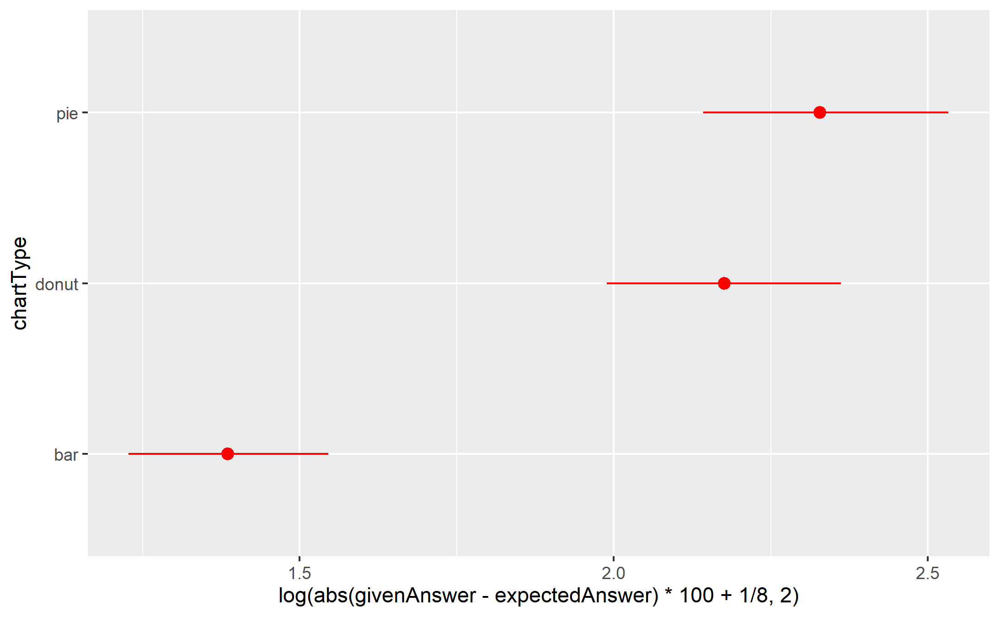
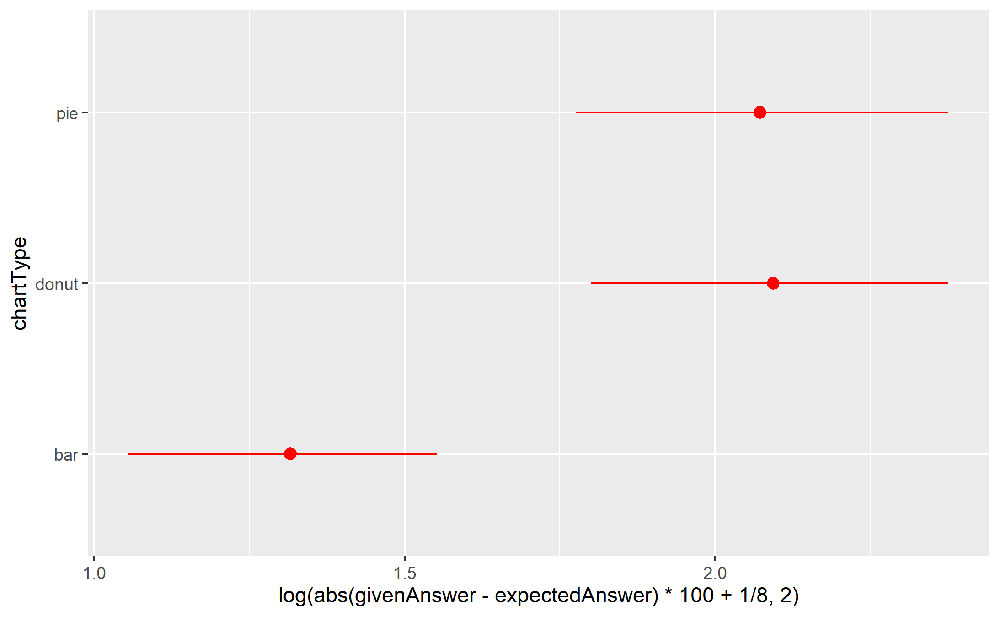
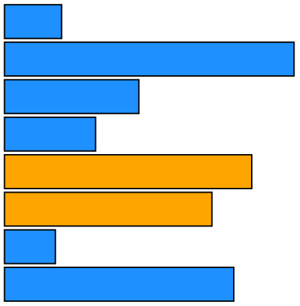

Assignment 3 - Replicating a Classic Experiment  
===

By Alexander Bell, Brian Earl, Haley Hauptfeld and Pooja Patel

Our experiment can be found [here](https://480x-21c-a3.glitch.me), which is the link to our experiment's hosting website.

We hypothesized that color does not affect how accurately we can perceive relative sizes of Bar, Pie, and Donut graphs, when compared to black-and-white versions of the same types of graphs. To test this, we ran 12 individuals through a series of randomly generated tests where each individual must compare the size difference of two selected data points on a series of graphs. For this, we chose to use a horizontal bar graph, a pie chart and a donut chart to test (images of each test can be found in the table below). Each individual was ran through 20 trials per graph type. For the first 10 trials, the graph was colored in, where the two selected data points was colored a separate color.  For the last 10 trials, the graph was in black an white, where the two selected data points were indicated with a black dot located besides them. 

Above is an screenshot what the user sees when going through the experiment. The instructions above the graph will alter themselves depending on the type of graph being shown. For inputting the desired estimate, the user is given a sider that goes between 0%-100%. After moving the slider to their guess, the user presses the "Submit Answer" button to move on to the next trial. 

Above is one graph of the results of our data. As you can see, Bar charts tended to be on average better than Donut or Pie charts. One interesting thing to note would be that the colored Pie chart's had a much larger error than the dot pie chart. THis could be due to the ordering of the elements in the experiment, where users encountered the colored pie chart first.

Above is the 95% confidence intervals for both the black-and-white and color graphs together.

Above is the 95% confidence intervals for just the color graphs.

Above is the 95% confidence intervals for just the black-and-white dot graphs.

# Chart Examples

|   Black and White Graphs    |        Color Graphs        |
| :-------------------------: | :------------------------: |
|      |  |
|      |       |
|  |   |

# Achievements

## **Technical Achievements**

- Implemented [Chance](https://chancejs.com/) in our chart generator.
- Implemented [d3-simple-slider](https://github.com/johnwalley/d3-simple-slider) for the users to input the percentages instead of having them input the numbers manually 

## **Design Achievements**

- Included an example on our introduction screen to help explain the task to the participant for effectively. 
-  Implemented [d3-simple-slider](https://github.com/johnwalley/d3-simple-slider) for the users to input the percentages instead of having them input the numbers manually 
- The instruction prompt above the graph changes depending on if the current chart is in color or is black and white

# References

For creating the graphs in our experiment, the following sites articles were referenced:

- [Bar Graph](https://bl.ocks.org/d3noob/bdf28027e0ce70bd132edc64f1dd7ea4)
- [Vertical Bar Graph](https://stackoverflow.com/questions/44817414/rotate-svg-in-place-using-d3-js)
- [Pie Chart](https://medium.com/codecakes/bts-d3-js-basic-pie-chart-d794f17b79bb)
- [Donut Chart](https://www.d3-graph-gallery.com/graph/donut_label.html)
- [Tree Map (Unused in experiment)](https://www.d3-graph-gallery.com/graph/treemap_basic.html)

For creating CSVs, this article was referenced

 - [JSON to CSV code](https://gist.github.com/dannypule/48418b4cd8223104c6c92e3016fc0f61)

For implementing the slider used in the Technical & Design acheivements, this segment of code was used

 - [d3-simple-slider](https://github.com/johnwalley/d3-simple-slider)

Requirements
---

- ~~Look it over Cleveland and McGill's original experiment (see the section below) and [watch this video](experiment-example.mp4) to get a sense of the experiment structure and where your visualizations will go.~~
- ~~When viewing the example experiment video, note the following:~~
    - ~~Trials are in random order.~~  
    - ~~Each trial has a randomly generated set of 5-10 data points.~~  
    - ~~Two of these data points are marked.~~  
    - ~~(Note: the experiment UI and User Experience could be better. Plenty of design achievements here).~~
- ~~Implement the data generation code **as described in the Cleveland & McGill paper**.~~ 
    - ~~The goal is to generate a set of random datapoints (usually 5 or 10, with values be between 0 and 100) and to mark two of them for comparison in the trial.~~ 
- ~~Add 3 visualizations (i.e. conditions) to your experiment. When you are adding these visualizations, think about *why* these visualizations are interesting to test. In other words, keep in mind a *testable hypothesis* for each of the added visualization. Some good options include bar charts, pie charts, stacked-bar charts, and treemaps. You can also rotate your bar chart to be horizontal or upside-down as one of your conditions. You are encouraged to test unorthodox charts -- radar charts come to mind, but there are MANY possibilities here-- feel free to be creative!~~
    - ~~Follow the style from Cleveland and McGill closely (e.g. no color, simple lines) unless you are specifically testing a hypothesis (e.g. color versus no color). Pay attention to spacing between elements like bars. Do not mark bars for comparison using color-- this makes the perceptual task too easy.~~
- ~~After each trial, implement code that grades and stores participant’s responses.~~
- ~~At the end of the experiment, to get the data, one easy option use Javascript to show the data from the current experiment\* (i.e. a comma separated list in a text box) and copy it into your master datafile. See the Background section below for an example of what this file should look like. (\*Alternately implement a server, if you're experienced with that sort of thing.)~~

- ~~Figure out how to calculate "Error", the difference between the true percentage and the reported percentage.~~
- ~~Scale this error using Cleveland and McGill’s log-base-2 error equation. For details, see the background section (there’s a figure with the equation). This becomes your “Error” column in the output. Make sure you use whole percentages (not decimal) in the log-base-2 equation. Make sure you handle the case of when a person gets the exact percentage correct (log-base-2 of 1/8 is -3, it is better to set this to 0).~~ 
- ~~Run your experiment with 10 or more participants, or-- make sure you get at least 200 trials **per visualization type** in total.~~  
    - ~~Grab friends or people in the class.~~   
    - ~~Run at least 20 trials per visualization type, per participant. This is to ensure that you cover the range of possible answers (e.g. 5%, 10%, ..., 95%)~~
- ~~Make sure to save the resulting CSV after each participant. Compile the results into a master csv file (all participants, all trials)~~.
- ~~Produce a README with figures that shows the visualizations you tested and results, ordered by best performance to worst performance. Follow the modern Cleveland-McGill figure below -- though note that using names instead of icons is fine.~~
- ~~To obtain the ranking, calculate and report the average log2Error for each visualization across all trials and participants. This should be straightforward to do in a spreadsheet.~~
- ~~Use Bootstrapped 95\% confidence intervals for your error upper and lower bounds. Include these in your figures. Bootstrapped confidence intervals are easily implemented in R~~ + ~~ggplot2 using the `stat_summary` geom. You can also use Excel, Python, or many many other tools. Bootstrapped 95% CIs are **very** useful in modern experiment practice.~~
- ~~Include example images of each visualization as they appeared in your experiment (i.e. if you used a pie chart show the actual pie chart you used in the experiment along with the markings, not an example from Google Images).~~
